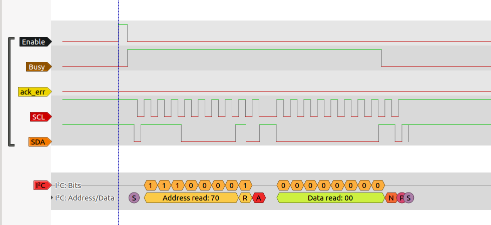
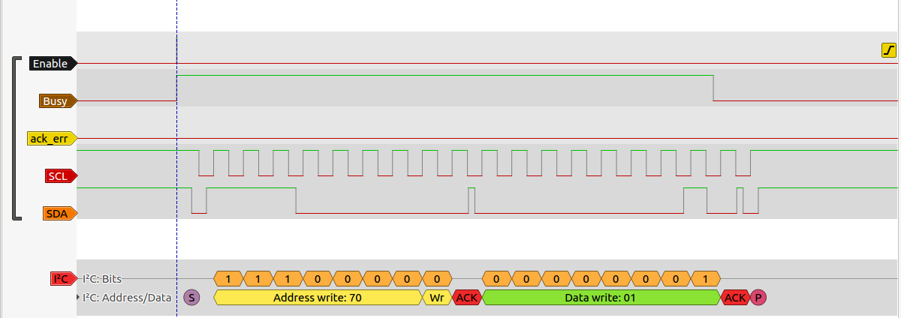
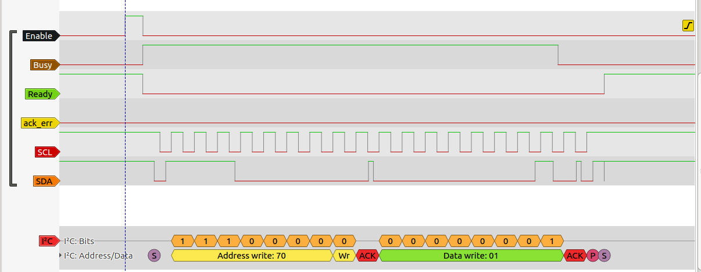
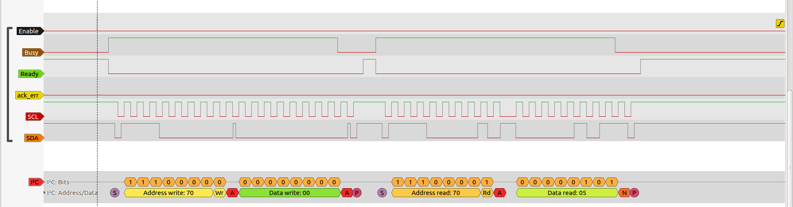
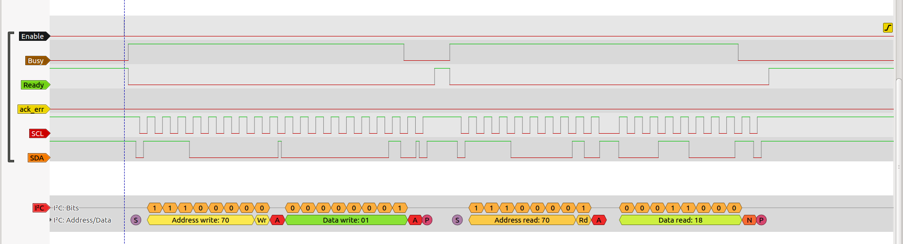

# IC2 LOG

## Jueves, 31-Agosto-2017

### Prueba 1: Puesta en marcha del Core. SIN PERIFERICO EXTERNO

Primera prueba con el I2C. Los resultados se ven en esta captura del analizador lógico. NO HAY PERIFERICO CONECTADO

El circuito se carga desde el fichero de Icestudio (test-i2c.ice). **Enable** es la entrada para que comience la tranmisión. Se activa mediante el pulsador SW2 y se llevav a un biestable set-reset para mantenerlo

El core del i2c responde activando la señal **Busy** que se conecta a la entrada reset del biestable, por lo que enable pasa a 0

Comienza la transmisión. Primero la condición de start y la dirección. El bit de ACK está a 1, por lo que el esclavo NO ha respondido. Esto es correcto porque NO hay esclavo conectado. El core activa la señal **ack-error**.

### Prueba 2: Conexión de un sensor de ultrasonidos SRF02

La documenntación para leer este sensor a través del I2C es esta:

[Sensor Ultrasonidos SRF02](https://www.robot-electronics.co.uk/htm/srf02techI2C.htm)

Tengo que soldar unos pines al sensor. El pin Mode se deja sin conectar. El resto: +5v, GND, SDA, SCL se conectarán a la Icezum Alhambra

* Importante: La dirección que viene de fábrica es: 0xE0. Me surge la primera duda: en el I2C las direcciones son de 7 bits... pero E0 es de 8... por donde corto... ¿Por el bit más significativo? ¿Por el menos? Tal vez debería ver el código en algún micro...

RESUELTO: En esta página hay código de Arduino: [SRF02 y Arduino](https://www.arduino.cc/en/Tutorial/SFRRangerReader)

Según esto, la dirección es **0x70**

Éxito! Ahora el periferico ha respondido con el ACK correcto, y la señal **ack-error NO se activa**!

Vamos por buen camino!! :-)

Las dudas que tengo ahora son... Cómo envío información al core para indicarle que quiero acceder a un registro?

### Prueba 3: Escritura de datos

Ya tengo un poco más claro el protocolo del I2C. Para **leer un registro** primero hay que hacer **UNA ESCRITURA**, indicando el registro al que quieres acceder. Yo quiero leer el **registro 1**, que según el datasheet tiene que devolver el valor 0x80.

La primera escritura ya la tengo. Es esta:

Se realiza correctamente (el dispositivo me devuelve los 2 ACKs)

Con esto tengo seleccionado el registro 01. Ahora, a continuación, tengo que enviar un comando de lectura, y me debería devolver el valor del registro 1....  Tengo que pensar en una mini-máquina de estados, que primero haga una escritura, y luego una lectura. La única diferencia entre ambas es la señal RW, que primero tiene que estar a 0 para la escritura y luego a 1 para la lectura...

### Prueba 4: Señal de Ready

Para poder leer correctamente tengo que hacer **primero una escritura** y **a continuación una lectura**  Para ello tengo que hacer un **autómata** que controle la comunicación con el core del i2c.

Necesito que el core me devuelva una señal adicional: **Ready**. Para indicar se ha enviado el comando anterior  (START ADDRESS DATA STOP). La señal de busy se desactiva cuando está listo para escribir un dato nuevo, pero NO UNA TRAMA. Necesito saber cuándo puedo empezar a enviar una trama nueva. Por ello voy a implementar la señal de ready y comprobar que está ok

Listo. Lo tengo. Si miramos ready, observamos que al terminar de enviarse la trama se pone a 1. Ya tengo la señal que necesito para inciar el envío de la trama de lectura!!!!!!

### Prueba 5: Automata para escritura y lectura

Vamos a por el autómata!!

Parece que la cosa va bien. Esto es lo que obtendo al leer del **registro 0**

Y esta es una lectura del **registro 1**

He colocado un switch externo para conmutar entre la lectura del registro 0 y 1 fácilmente. Las buenas noticias es que los valores leidos son estables. Del registro 0 se lee 5, y del registro 1: 0x18. Siempre. Las malas son que según el datasheet, del registro 1 se debería leer 0x80...

SOLUCIONADO!!!! En las transparencias del I2C de Andrés del curso del CSIC se usa este mismo sensor de Ultrasonidos... y en la documentación pone que lo leido en los registros 0 y 1 es 0x05 y 0x18!!!!! Perfecto!!!!  :-)

YA ENTIENDO EL I2C!!!!

### Pruebas con el ADC de la icezum
